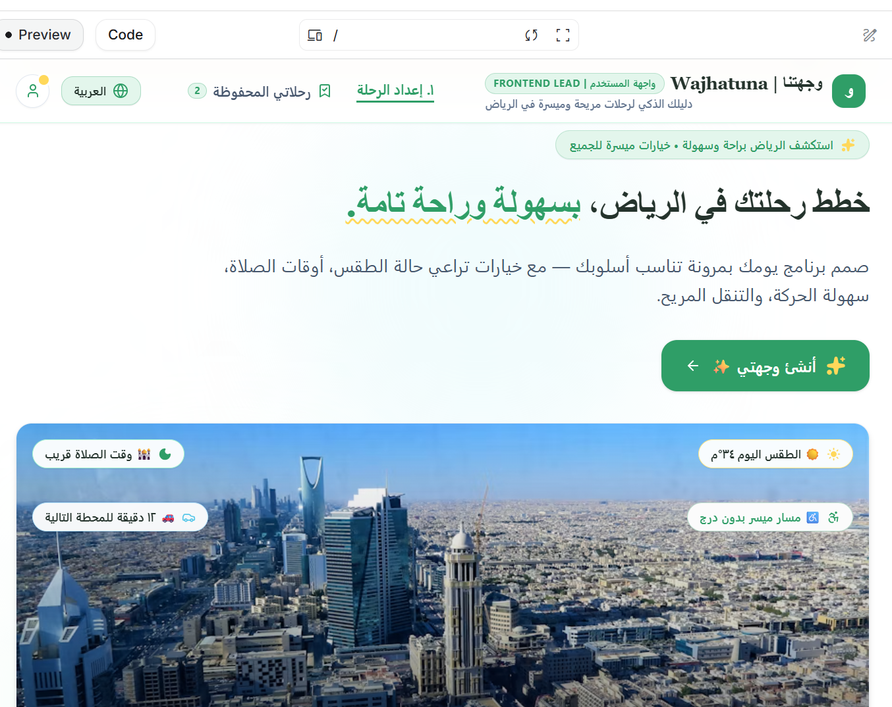
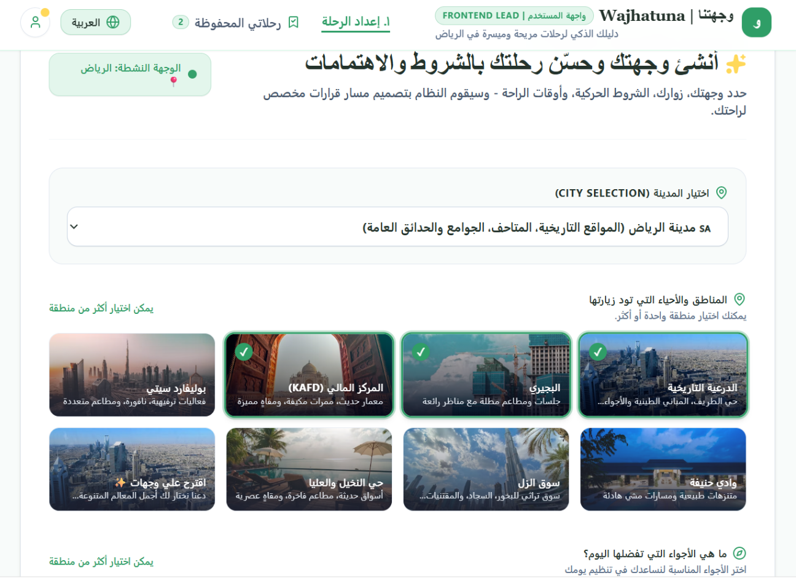

# Wejhatna Prototype

This folder contains the early interactive prototype of **Wejhatna (وجهتنا)**, a smart and accessible Riyadh trip-planning experience.

The prototype was created to explore the user experience before integrating the final AI Agent and backend. It demonstrates the main journey-planning flow, including destination and area selection, user preferences, accessibility-focused choices, and a visual Riyadh travel experience.

## Prototype Link

Open the interactive prototype in Google AI Studio:

https://aistudio.google.com/apps/b39b4bba-7f2f-4c0c-8b92-b80fea332ad6?project=gen-lang-client-0530250805&showPreview=true&pli=1&showAssistant=true

## What the Prototype Demonstrates

- A simple and welcoming trip-planning flow for Riyadh.
- Selection of preferred districts, attractions, and interests.
- Accessibility-aware travel planning concepts.
- A visual direction for the Wejhatna user experience and branding.
- An early concept used to validate the interface and user journey before connecting the final planning Agent and live data tools.

## Technical Notes

The prototype uses a React + Vite setup with TypeScript and Tailwind CSS. The project configuration also includes Google Maps-related dependencies and Google GenAI support for the prototype environment.

## Screenshots

Below are screenshots from the interactive prototype showing the main Wejhatna experience and the trip-planning interface.

### Home Experience

### Trip Planner

> Note: This prototype represents an early UI/UX concept. The final Wejhatna implementation may differ as the AI Agent, live APIs, routing, traffic, weather, prayer-time logic, and database integrations are connected.
